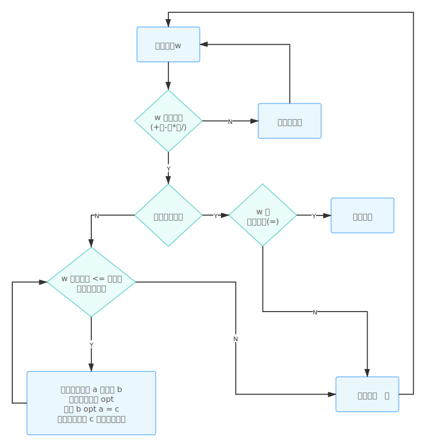

# 一个简单的 JS 计算器

[效果预览](https://zhijiang3.github.io/calculator)

在学习数据结构与算法的栈这个数据结构时，恰巧学习资料中有提到使用栈来模拟算术表达式的计算功能。

## 实现细节

我们先设定运算符号的优先级：

| 运算符 | 优先级 |
|:------:|:------:|
|   -    |   1    |
|   +    |   1    |
|   /    |   2    |
|   *    |   2    |

然后设置两个栈，一个是**操作数栈**`operands`，一个是**运算符栈**`operator`，其流程图如下：

具体的实现代码位于 [src/core/Calculator.js](src/core/Calculator.js)，如果感兴趣的话，可以翻看源码。

## 界面设计

感谢 kon 同学设计的界面 👏👏
